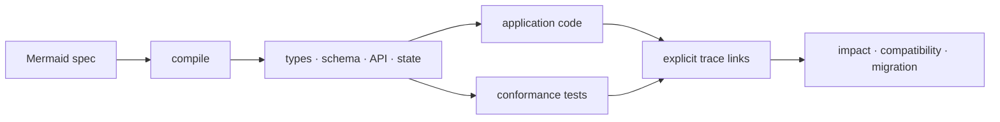

# mermaid-spec

[](https://github.com/ga-ut/mermaid-spec/actions/workflows/ci.yml)
[](https://github.com/ga-ut/mermaid-spec/releases)
[](./LICENSE)

Turn Mermaid diagrams into contracts that code and tests can follow.

`mermaid-spec` compiles a strict Mermaid-compatible subset into TypeScript,
JSON Schema, PostgreSQL DDL, OpenAPI, validated HTTP routing, and executable
state machines. It also records the links from each contract to the code,
tests, UI consumers, and documentation that realize it.

The compiler is deterministic: the same version and source produce the same
artifacts. Unsupported or ambiguous syntax stops the build instead of being
interpreted by a human or AI.



## What v1 owns

- Data contracts with separate `table`, `schema`, and reusable `value` roles;
  optional and nullable fields, arrays, nested references, enums, defaults, and
  common constraints.
- HTTP contracts with typed path, query, header, and cookie inputs; structured
  errors; pagination; security metadata; OpenAPI; and a validating Fetch router.
- State contracts bound to model fields, generated transition helpers, and
  scenarios that execute application-owned guards and effects.
- A contract graph with stable IDs, source locations, explicit implementation
  and test links, bounded context retrieval, change impact, compatibility, and
  migration-safety reports.

Application code still owns business decisions, identity and authorization,
database connections and migration execution, framework UI, deployment, and
operations. The compiler makes those boundaries visible; it does not generate
an application whose behavior was never specified.

## Install

Version 1 is available as a GitHub source release:

```bash
bun add --dev github:ga-ut/mermaid-spec#v1.0.0
```

Use `bunx mermaid-spec` in scripts. Bun 1.3.14 or newer is required; Node.js is
not a supported runtime.

## Contract loop

Keep Mermaid blocks in Markdown files under a specification directory:

```bash
bunx mermaid-spec build ./specs --out ./generated
bunx mermaid-spec test ./specs --handlers ./scenario-handlers.js
bunx mermaid-spec verify ./specs --out ./generated \
  --links ./mermaid-spec.links.json
```

Before accepting a spec change, inspect what it affects:

```bash
bunx mermaid-spec impact ./specs \
  --baseline ./baseline/contract-graph.generated.json \
  --links ./mermaid-spec.links.json

bunx mermaid-spec compatibility ./specs \
  --baseline ./baseline/contract-graph.generated.json

bunx mermaid-spec migration ./specs \
  --baseline ./baseline/contract-graph.generated.json
```

`compatibility` fails for breaking contract changes. `migration` emits SQL only
for changes it can classify safely; destructive or context-dependent changes
stay in the report for application review. Neither command changes a database.

For one work item, `context` returns the selected contract, dependencies,
dependents, and linked files so a person or coding agent receives bounded,
explicit context:

```bash
bunx mermaid-spec context ./specs \
  --id operation:createTask \
  --links ./mermaid-spec.links.json \
  --include-files --json
```

New contracts can be bootstrapped before their implementation exists.
`impact` and `context` return missing required roles as `coverageGaps`, while
`verify` remains strict and fails until the implementation, tests, and any
required consumers are explicitly linked.

## Full-stack proof

[`examples/full-stack`](./examples/full-stack) is a persistent task service and
responsive browser UI built around the generated contracts. It includes:

- versioned Bun SQLite migration and restart recovery;
- app-owned access policy and optimistic version checks;
- generated request/response validation, routing, and lifecycle transitions;
- a browser consumer linked to the API operations;
- invalid-input, access-denial, state-rejection, pagination, UI, migration, and
  recovery tests.

Run it locally:

```bash
bun run example:full-stack:serve
```

The smaller [`examples/product`](./examples/product) and
[`examples/issue-tracker`](./examples/issue-tracker) isolate individual
compiler capabilities.

## Supported syntax and boundaries

The accepted grammar and directives are documented in
[`docs/syntax.md`](./docs/syntax.md). The traceability workflow is in
[`docs/harness.md`](./docs/harness.md), and the evidence-based production fit is
in [`docs/product-readiness.md`](./docs/product-readiness.md).

Version 1 is suited to bounded CRUD and lifecycle-heavy vertical slices whose
contracts fit the supported grammar. It does not yet cover multipart or
streaming HTTP, general unions, generated browser clients, composite workflows,
timers, retries, arbitrary indexes, transaction policy, or distributed-system
recovery. High-risk systems such as payments still require their own domain,
security, idempotency, audit, and operational controls.

## Development

```bash
bun ci
bun run verify
```

The verification gate runs unit and integration tests with coverage thresholds,
all executable examples and scenarios, generated-file and trace-link checks,
compatibility and migration checks, generated TypeScript compilation, OpenAPI
validation, and an installed-package smoke test. Generated example files are
committed and must not be edited by hand.

See [`CONTRIBUTING.md`](./CONTRIBUTING.md) and
[`docs/versioning.md`](./docs/versioning.md) before changing public syntax or
generated output.

## Relationship to Mermaid

This is an independent project that consumes Mermaid-compatible source text. It
is not affiliated with or endorsed by the Mermaid project, and it does not
change Mermaid's renderer or core grammar.

## License

MIT
