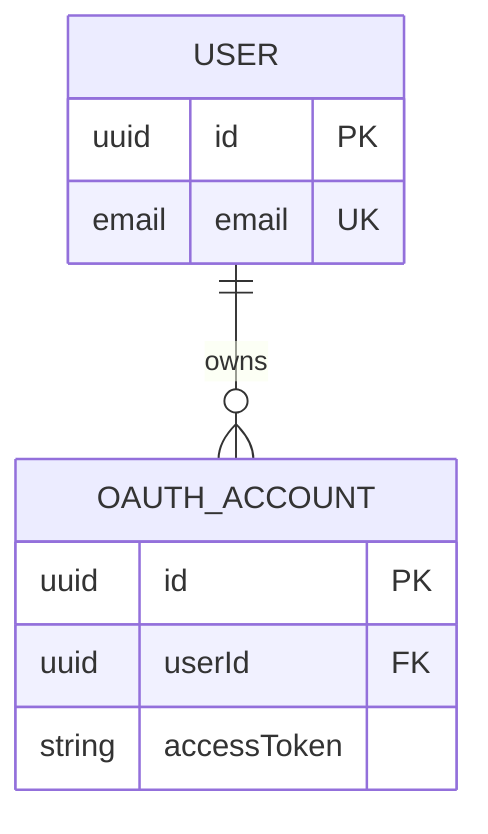
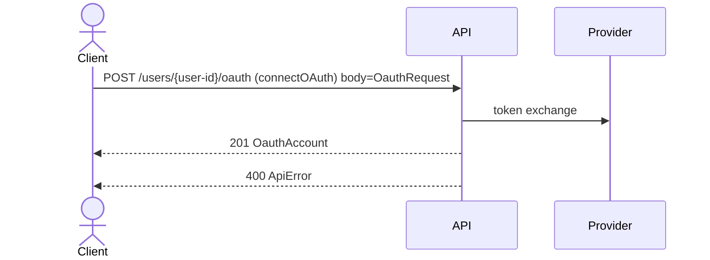

# Supported Mermaid contract syntax

`mermaid-spec` accepts a deliberately small Mermaid-compatible subset. Source files are Markdown files containing fenced `mermaid` blocks. A project may split diagrams across files and directories; files and generated artifacts are processed in deterministic lexical order.

Unsupported statements fail the build. Visual Mermaid features that do not change the contract are supported only where this document says so.

## Names and generated identifiers

Names start with an ASCII letter or underscore and may then contain ASCII letters, digits, underscores, or hyphens.

Mermaid names are normalized when a target language requires it. For example, `OAUTH_ACCOUNT`, `OauthAccount`, and `oauth-account` all generate the TypeScript model name `OauthAccount`. A project that contains names which collide after TypeScript or SQL normalization fails the build.

Entity property names and API operation identifiers are quoted in generated TypeScript, so Mermaid-safe hyphenated names remain usable.

## Entity and data model

Use an `erDiagram` block. Entity attributes use this form:

```text
type name [PK] [FK] [UK] ["comment"]
```

Keys may be separated by spaces or commas. Properties and SQL columns are required by default; explicit field directives relax or constrain that default.

Models default to the `table` role for backward compatibility. Use Mermaid comment directives to separate persistence from API and reusable value contracts:

```text
%% @model USER table
%% @model CreateUserInput schema
%% @model Address value
```

- `table` emits TypeScript, JSON Schema, and PostgreSQL DDL.
- `schema` emits TypeScript and JSON Schema for request, response, or event payloads.
- `value` emits a reusable nested TypeScript and JSON Schema value object.

Schema and value models cannot declare `PK`, `FK`, or `UK`. ER relationships may connect table models only. A field type may name another model to create a nested `$ref`; referenced table models remain JSON values when embedded in another model.

Field contracts use a second explicit directive:

```text
%% @field USER.nickname optional nullable minLength=2 maxLength=40
%% @field USER.status enum=active,suspended default="active"
%% @field USER.score minimum=0 maximum=100
%% @field CreateUserInput.address optional
%% @field CreateUserInput.tags array minItems=1 maxItems=5
```

Supported flags are `optional`, `nullable`, and `array`. Supported values are `enum`, `default` (a compact JSON literal), `minimum`, `maximum`, `minLength`, `maxLength`, `pattern`, `minItems`, and `maxItems`. Optional properties are excluded from JSON Schema `required`; nullable properties explicitly accept `null`. Runtime request and response validation enforces the same emitted constraints.

| Mermaid type | TypeScript | JSON Schema | PostgreSQL |
| --- | --- | --- | --- |
| `uuid` | `string` | string, UUID format | `UUID` |
| `string` | `string` | string | `VARCHAR(255)` |
| `text` | `string` | string | `TEXT` |
| `email` | `string` | string, email format | `VARCHAR(320)` |
| `datetime` | `string` | string, date-time format | `TIMESTAMPTZ` |
| `date` | `string` | string, date format | `DATE` |
| `int`, `integer` | `number` | integer | `INTEGER` |
| `float` | `number` | number | `DOUBLE PRECISION` |
| `boolean` | `boolean` | boolean | `BOOLEAN` |
| `json` | `unknown` | object | `JSONB` |

Example:

````markdown

````

Foreign keys use a deterministic naming convention: `<target entity name>Id FK`. `userId FK` resolves to the single-column primary key on `USER`. The SQL types must match. Foreign keys are emitted after every table declaration, so entity order and cyclic table references do not produce invalid creation order.

Multiple `PK` attributes on one entity generate a composite primary key. A naming-inferred foreign key can reference only a target with a single-column primary key. ER relationship lines are retained as readable documentation; the explicit `FK` attribute owns the generated database constraint.

Schema migrations, indexes beyond `PK`/`UK`, explicit constraint names, and custom SQL types are not supported. Compatibility and migration safety are reported separately rather than silently altering an existing database.

## HTTP API

Use a `sequenceDiagram` block. Participants and actors are documentation. A solid client-to-server message becomes an HTTP operation when its label has this form:

```text
METHOD /path (operationId) [body=Model]
```

Supported methods are `GET`, `POST`, `PUT`, `PATCH`, and `DELETE`. A dashed response message declares a response:

```text
STATUS [Model]
```

Example:

````markdown

````

Every operation requires at least one declared response. Request and response models must resolve to entities declared in the project. HTTP status codes must be between 100 and 599.

Path parameters occupy a complete path segment, such as `{user-id}`. Duplicate parameters and mixed segments such as `{id}.json` fail the build. Generated OpenAPI operations declare every path parameter as a required string, and the Fetch router exposes decoded values through `request.params`.

Declare typed request inputs with Mermaid comments. Explicit path declarations override the default string type; query, header, and cookie declarations are added to the operation:

```text
%% @param listIssues path team-id uuid required
%% @param listIssues query status string optional enum=open,closed
%% @param listIssues query limit int optional minimum=1 maximum=100
%% @param listIssues header x-request-id uuid required
%% @param listIssues cookie locale string optional
```

Supported parameter types are `string`, `text`, `email`, `uuid`, `date`, `datetime`, `int`, `integer`, `float`, and `boolean`. Numeric and string constraints use the same names as model fields. The generated Fetch router rejects missing or invalid values before the handler runs and exposes parsed values through `params`, `queryParams`, `headers`, and `cookies`; the original `URLSearchParams` remains available as `query`.

Security, error, pagination, and JSON media contracts use operation-scoped directives:

```text
%% @security listIssues bearer
%% @error listIssues 401 ApiError
%% @pagination listIssues cursor limit nextCursor
%% @content listIssues response=application/json
```

`@security` emits OpenAPI bearer or named access-key requirements. Authentication and authorization decisions still belong to application handlers, which receive the original `Request` as `raw`. `@error` must match a declared 4xx or 5xx response with its structured model. `@pagination` requires declared cursor and limit query parameters plus the named field on a successful response model. Supported media types are `application/json` and `application/problem+json`.

Internal sequence messages that do not match the HTTP request or response forms remain diagram documentation and do not generate code.

Generated routers accept JSON request and response bodies only. A declared request model is required and validated before the handler runs. Sending a body to an operation without `body=Model` is rejected. Handler responses must use a declared status, omit bodies for model-free responses, and satisfy the declared response model.

Multipart bodies, binary responses, streaming, and OAuth flow configuration are not supported. Security declarations describe the contract and required integration point; they do not implement an application's identity or authorization policy.

## State machines

Use a `stateDiagram` or `stateDiagram-v2` block. A machine requires exactly one initial transition:

```text
[*] --> InitialState
```

State-to-state transitions use:

```text
From --> To : event [guard] / effect
```

The guard and effect are optional named application handlers. A terminal transition uses `State --> [*]`. The same state cannot declare the same event more than once, and every declared state must be reachable from the initial state.

The optional directive `%% @name MachineName` sets the generated machine name. Executable examples use:

```text
%% @test From --event--> To
%% @test From --event--> !invalid
```

Bind the machine to a model state field whose string enum exactly matches the machine states:

```text
%% @bind ISSUE.status
```

The compiler then emits record transition helpers and adds a dependency from the machine to the model field. This prevents a diagram state from drifting away from its persisted representation.

Behavioral scenarios execute the real named guard and effect handlers. Context and partial context expectations are compact JSON objects:

```text
%% @scenario starts Backlog --start--> InProgress context={"owner":"alex"} expect={"assigned":true}
%% @scenario blocked InProgress --resolve--> !invalid context={"resolution":""}
```

Run them with an application-owned module. Its default export maps machine names to `guards` and `effects` objects:

```bash
bunx mermaid-spec test ./specs --handlers ./scenario-handlers.js
```

An expected `!invalid` only accepts a rejected or absent transition. Missing handlers and application errors fail the scenario instead of being mistaken for an expected rejection. Each scenario is also a stable node in the generated contract graph.

The `direction TB|BT|LR|RL` statement and display declarations in the form `state "Display label" as Identifier` are accepted. Notes, composite states, forks, joins, concurrency, choice nodes, and inline executable expressions are not supported.

## Project commands

```bash
bunx mermaid-spec build ./specs --out ./generated
bunx mermaid-spec test ./specs
bunx mermaid-spec verify ./specs --out ./generated
```

`build` writes all deterministic artifacts and a content-addressed manifest. `test` runs every structural `%% @test` example and executable `%% @scenario` case. `verify` recompiles in memory and fails for missing, changed, or stale files in the output directory.
