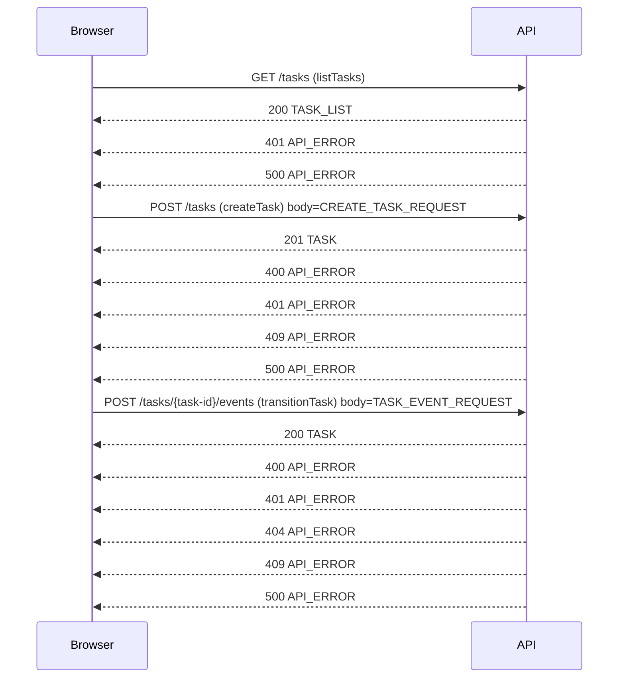

# Workboard API

```mermaid
sequenceDiagram
  participant Browser
  participant API

  %% @param listTasks query cursor string optional
  %% @param listTasks query limit int optional minimum=1 maximum=50
  %% @param listTasks header x-actor-id string required minLength=1
  %% @security listTasks apiKey header x-actor-id
  %% @error listTasks 401 API_ERROR
  %% @error listTasks 500 API_ERROR
  %% @pagination listTasks cursor limit nextCursor
  Browser->>API: GET /tasks (listTasks)
  API-->>Browser: 200 TASK_LIST
  API-->>Browser: 401 API_ERROR
  API-->>Browser: 500 API_ERROR

  %% @param createTask header x-actor-id string required minLength=1
  %% @security createTask apiKey header x-actor-id
  %% @error createTask 400 API_ERROR
  %% @error createTask 401 API_ERROR
  %% @error createTask 409 API_ERROR
  %% @error createTask 500 API_ERROR
  Browser->>API: POST /tasks (createTask) body=CREATE_TASK_REQUEST
  API-->>Browser: 201 TASK
  API-->>Browser: 400 API_ERROR
  API-->>Browser: 401 API_ERROR
  API-->>Browser: 409 API_ERROR
  API-->>Browser: 500 API_ERROR

  %% @param transitionTask path task-id uuid required
  %% @param transitionTask header x-actor-id string required minLength=1
  %% @security transitionTask apiKey header x-actor-id
  %% @error transitionTask 400 API_ERROR
  %% @error transitionTask 401 API_ERROR
  %% @error transitionTask 404 API_ERROR
  %% @error transitionTask 409 API_ERROR
  %% @error transitionTask 500 API_ERROR
  Browser->>API: POST /tasks/{task-id}/events (transitionTask) body=TASK_EVENT_REQUEST
  API-->>Browser: 200 TASK
  API-->>Browser: 400 API_ERROR
  API-->>Browser: 401 API_ERROR
  API-->>Browser: 404 API_ERROR
  API-->>Browser: 409 API_ERROR
  API-->>Browser: 500 API_ERROR
```
