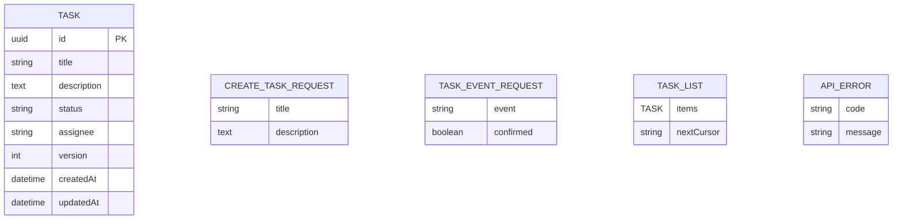

# Workboard domain

```mermaid
erDiagram
  %% @model TASK table
  %% @model CREATE_TASK_REQUEST schema
  %% @model TASK_EVENT_REQUEST schema
  %% @model TASK_LIST schema
  %% @model API_ERROR schema
  %% @field TASK.title minLength=2 maxLength=80
  %% @field TASK.description maxLength=400
  %% @field TASK.status enum=Backlog,InProgress,Done
  %% @field TASK.assignee optional
  %% @field TASK.version minimum=1
  %% @field CREATE_TASK_REQUEST.title minLength=2 maxLength=80
  %% @field CREATE_TASK_REQUEST.description maxLength=400
  %% @field TASK_EVENT_REQUEST.event enum=start,complete,reopen
  %% @field TASK_EVENT_REQUEST.confirmed optional default=false
  %% @field TASK_LIST.items array maxItems=50
  %% @field TASK_LIST.nextCursor optional nullable
  %% @field API_ERROR.code minLength=1
  %% @field API_ERROR.message minLength=1

  TASK {
    uuid id PK
    string title
    text description
    string status
    string assignee
    int version
    datetime createdAt
    datetime updatedAt
  }

  CREATE_TASK_REQUEST {
    string title
    text description
  }

  TASK_EVENT_REQUEST {
    string event
    boolean confirmed
  }

  TASK_LIST {
    TASK items
    string nextCursor
  }

  API_ERROR {
    string code
    string message
  }
```
