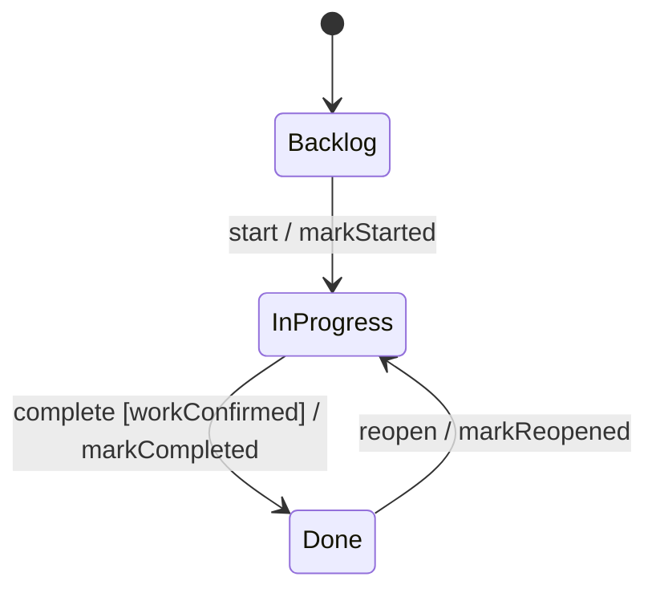

# Task lifecycle

```mermaid
stateDiagram-v2
  %% @name TaskLifecycle
  %% @bind TASK.status
  [*] --> Backlog
  Backlog --> InProgress : start / markStarted
  InProgress --> Done : complete [workConfirmed] / markCompleted
  Done --> InProgress : reopen / markReopened

  %% @test Backlog --start--> InProgress
  %% @test InProgress --complete--> Done
  %% @test Backlog --complete--> !invalid
  %% @scenario starts Backlog --start--> InProgress context={} expect={"started":true}
  %% @scenario completes InProgress --complete--> Done context={"confirmed":true} expect={"completed":true}
  %% @scenario blocksUnconfirmed InProgress --complete--> !invalid context={"confirmed":false}
  %% @scenario reopens Done --reopen--> InProgress context={} expect={"reopened":true}
```
