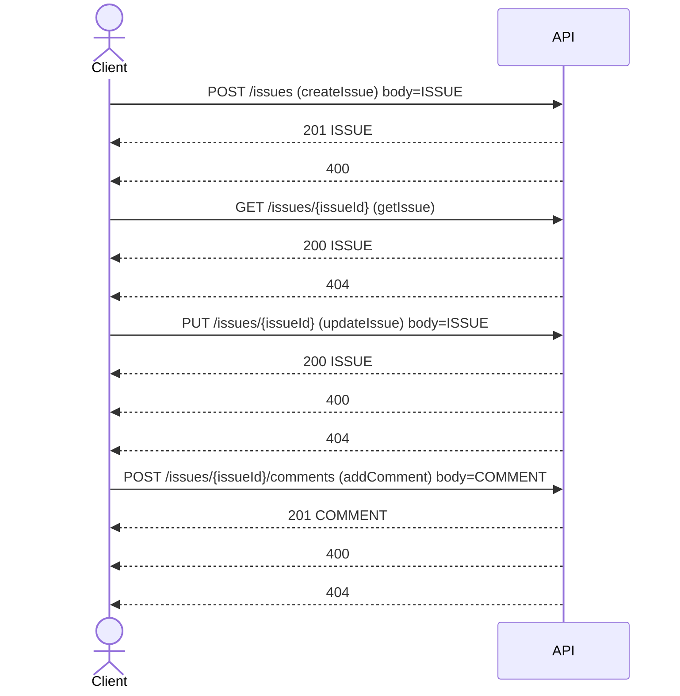

# Issue tracker HTTP API

```mermaid
sequenceDiagram
  actor Client
  participant API

  Client->>API: POST /issues (createIssue) body=ISSUE
  API-->>Client: 201 ISSUE
  API-->>Client: 400

  Client->>API: GET /issues/{issueId} (getIssue)
  API-->>Client: 200 ISSUE
  API-->>Client: 404

  Client->>API: PUT /issues/{issueId} (updateIssue) body=ISSUE
  API-->>Client: 200 ISSUE
  API-->>Client: 400
  API-->>Client: 404

  Client->>API: POST /issues/{issueId}/comments (addComment) body=COMMENT
  API-->>Client: 201 COMMENT
  API-->>Client: 400
  API-->>Client: 404
```
