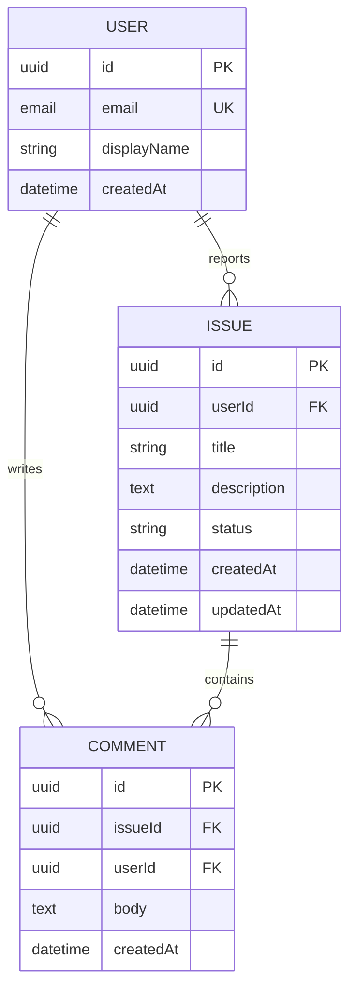

# Issue tracker domain

```mermaid
erDiagram
  %% @field ISSUE.status enum=Backlog,InProgress,Resolved
  USER ||--o{ ISSUE : reports
  USER ||--o{ COMMENT : writes
  ISSUE ||--o{ COMMENT : contains

  USER {
    uuid id PK
    email email UK
    string displayName
    datetime createdAt
  }

  ISSUE {
    uuid id PK
    uuid userId FK
    string title
    text description
    string status
    datetime createdAt
    datetime updatedAt
  }

  COMMENT {
    uuid id PK
    uuid issueId FK
    uuid userId FK
    text body
    datetime createdAt
  }
```
