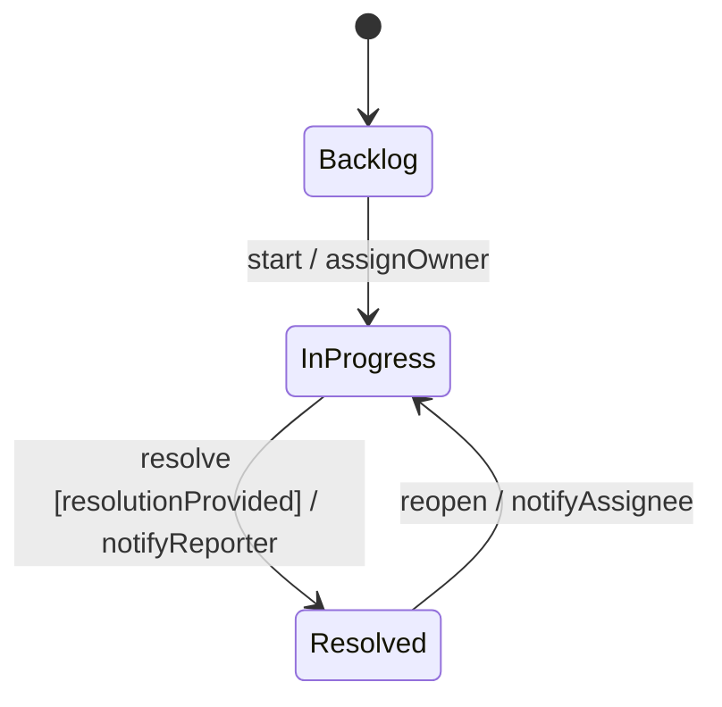

# Issue lifecycle

```mermaid
stateDiagram-v2
  %% @name IssueLifecycle
  %% @bind ISSUE.status
  [*] --> Backlog
  Backlog --> InProgress : start / assignOwner
  InProgress --> Resolved : resolve [resolutionProvided] / notifyReporter
  Resolved --> InProgress : reopen / notifyAssignee

  %% @test Backlog --start--> InProgress
  %% @test InProgress --resolve--> Resolved
  %% @test Backlog --resolve--> !invalid
  %% @scenario startsWork Backlog --start--> InProgress context={"owner":"alex"} expect={"assigned":true}
  %% @scenario resolvesIssue InProgress --resolve--> Resolved context={"resolution":"fixed"} expect={"reporterNotified":true}
  %% @scenario blocksEmptyResolution InProgress --resolve--> !invalid context={"resolution":""}
```
