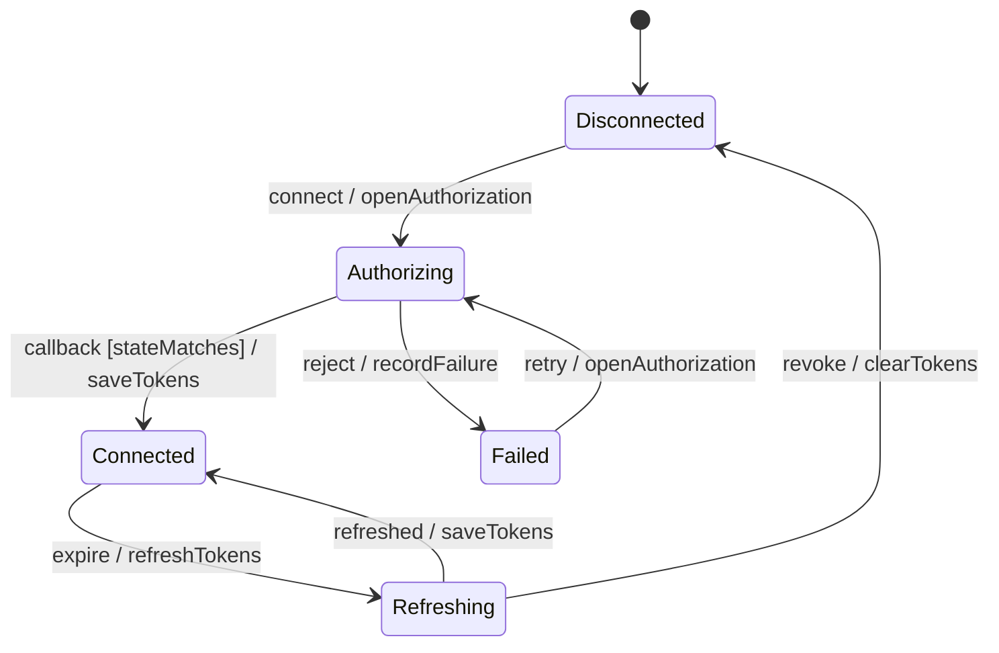

# OAuth account connection

```mermaid
stateDiagram-v2
  [*] --> Disconnected
  Disconnected --> Authorizing : connect / openAuthorization
  Authorizing --> Connected : callback [stateMatches] / saveTokens
  Authorizing --> Failed : reject / recordFailure
  Failed --> Authorizing : retry / openAuthorization
  Connected --> Refreshing : expire / refreshTokens
  Refreshing --> Connected : refreshed / saveTokens
  Refreshing --> Disconnected : revoke / clearTokens

  %% @test Disconnected --connect--> Authorizing
  %% @test Authorizing --callback--> Connected
  %% @test Connected --retry--> !invalid
```
