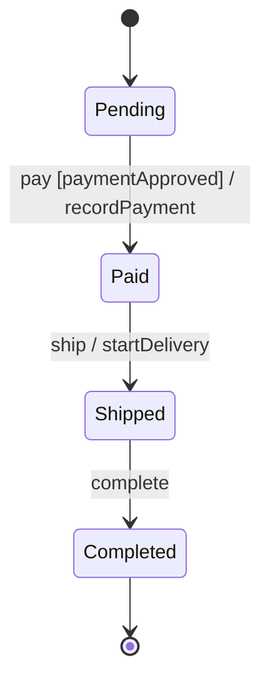

# Order lifecycle

This document is both readable documentation and an executable specification.

```mermaid
stateDiagram-v2
  [*] --> Pending
  Pending --> Paid : pay [paymentApproved] / recordPayment
  Paid --> Shipped : ship / startDelivery
  Shipped --> Completed : complete
  Completed --> [*]

  %% @test Pending --pay--> Paid
  %% @test Paid --ship--> Shipped
  %% @test Pending --ship--> !invalid
```
