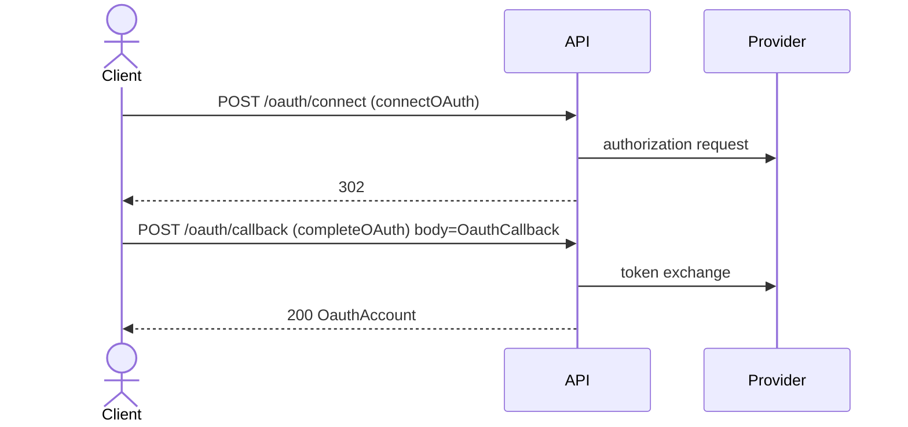

# OAuth HTTP API

```mermaid
sequenceDiagram
  actor Client
  participant API
  participant Provider

  Client->>API: POST /oauth/connect (connectOAuth)
  API->>Provider: authorization request
  API-->>Client: 302

  Client->>API: POST /oauth/callback (completeOAuth) body=OauthCallback
  API->>Provider: token exchange
  API-->>Client: 200 OauthAccount
```
