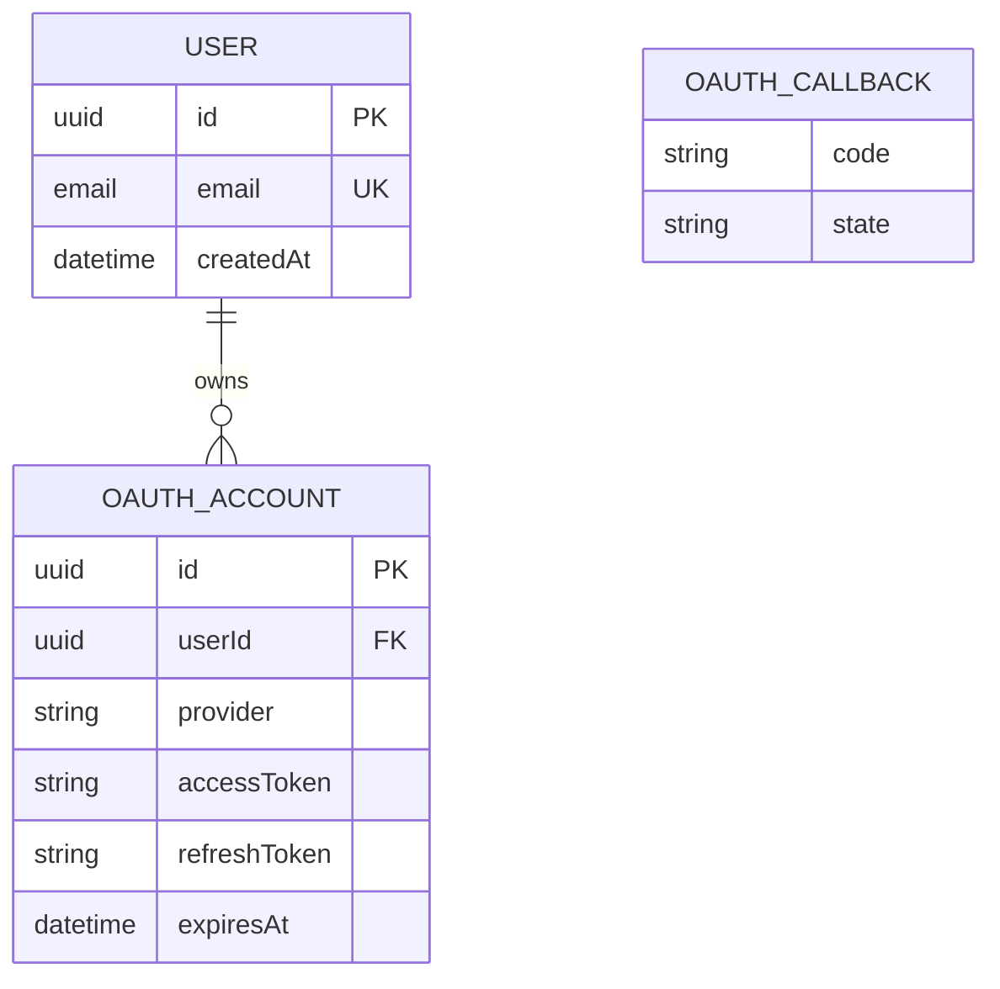

# OAuth product data model

```mermaid
erDiagram
  USER ||--o{ OAUTH_ACCOUNT : owns

  USER {
    uuid id PK
    email email UK
    datetime createdAt
  }

  OAUTH_ACCOUNT {
    uuid id PK
    uuid userId FK
    string provider
    string accessToken
    string refreshToken
    datetime expiresAt
  }

  OAUTH_CALLBACK {
    string code
    string state
  }
```
